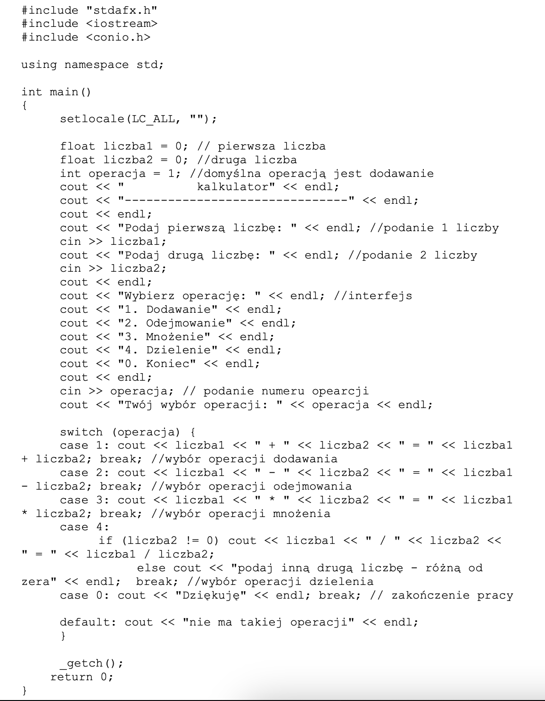

# Podstawy programowania w C++
---

### Zadanie 4
Napisz program, który obliczy sumę kdwadratów liczb od `1` do `n`. Zastosuj instrukcję pętli <b>for</b>. Wyświetl wynik w postaci:
<code>
cout << "1*1 + 2*2 + ... + n*n" << suma << endl;
</code>

### Zadanie 5
Napisz program, który realizuje następujący pseudokod:

    Algorytm wczytuje dwie liczby i sprawdza, która jest większa.

    Start
        Wczytaj(a, b)
        Jezeli a>b to 
            Wypisz(a)
        W przeciwnym razie
    Wypisz(b)
    Koniec

### Zadanie 6
Napisz program, który realizuje następujący pseudokod:

    Algorytm wczytuje i sumuje n liczb.
    
    Start
        Suma = 0
        Podaj(n)
        i = 0
        Dopóki i < n wykonuj:
            Wczytaj(a)
            Suma = suma + 2
            i = i + 1
        Wypisz(Suma)
    Koniec

### Zadanie 7
Napisz program, który pobierze z konsoli całkowitą liczbę nieujemną. Gdy wprowadzana liczba okaze się ujemna, program powinien poinformować w konsoli o błędnej wartości i zakończyć działanie.
Następnie, program powinien policzyć wartość silni dla wprowadzonej liczby. Liczenie powinno odbyć się trzykrotnie, za kadym razem z uzyciem róznej pętli: `for`, `while` lub `do..while`.
Na końcu, program powinien wydrukować wyniki obliczeń na konsoli, trzykrotnie, dla wyniku działania kazdej pętli. Wyniki powinny zostac wydrukowane w osobnych liniach.

### Zadanie 8
Napisz program, który pobierze z konsoli dwie liczby całkowite. Następnie, na konsoli wydrukuje prostokąt zlozony z hashy `#`, o wymiarach zgodnych z wprowadzonymi wczesniej liczbami (pierwszy z wymiarow to szerokosc prostokata). 
Jezeli ktorakolwiek z wprowadzonych liczb byla niedodatnia, program powinien zakonczyc dzialanie bez drukowania czegokolwiek.
Przyklad wydruku dla liczb 3 i 4:
<code>
###
###
###
###
</code>

### Zadanie 9
Algorytm sprawdzający, czy suma dwóch liczb podanych przez uzytkownika jest parzysta. Wskazówka: instrukcję wyznaczającą resztę z dzielenia liczby `a` przez `b` (czyli <b>a mod b</b>) zapisuje się w jezyku C jako `a % b`.

### Zadanie 10
Program, będący prostym kalkulatorem (napisany na pierwszych zajęciach - kod ponizej) przeksztalc do takiej postaci, aby obliczenia mozna bylo wykonywac do momentu podania przez uzytkownika 0, ktore oznacza koniec pracy. Do zautomatyzowania pracy uzyj petli - wybierz optymalna petle, ktora uwzgledni specyfikę algorytmu. 

### Zadanie 11
Napisz program, który jest prostą grą. Twoim zadaniem w grze jest odgadnięcie wylosowanej przez komputer liczby ( z przedzialu `od 1 do 100`). Przy kazdej probie otrzymujesz wskazowkę, mowiaca czy wpisana przez ciebie wartosc jest za duza, czy za mala. Na poczatku gry wprowadz ograniczenie na liczbe krokow, w ktorych mozna odgadnac wylosowana liczbe. W przypadku odgadniecia wylosowanej gry niech pojawi sie komunikat "Wygrales" oraz obok liczba krokow, ktora byla potrzebna aby adgadnac liczbe.
Do wylosowania liczby uzyj nastepujacej linii kodu (generator liczb losowych):
<code>
#include <cstdlib>
#include <ctime>

srand ((int) time(NULL));
int Wylosowana = rand() % 100 + 1;
</code>

### Zadanie 12
Napisz program, ktory pobierze w konsoli napis, a nastepnie wydrukuje go w konsoli, w otoczeniu ramki zlozonej z gwiazdek `*`. Gdy napis okaze sie pusty, program powinien ponownie poprosic o jego wprowadzenie. 
Przyklad wydruku dla napisu "Serce do walki":
<code>
****************
*Serce do walki*
****************
</code>
