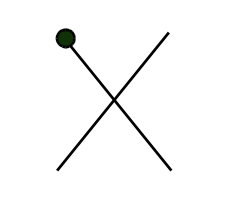

# Projekt zaliczeniowy nr 169

Napisz program rysowania znakiem ASCII poniższej figury. Program powinien umożliwić:
<li> wybór znaku kodu ASCII </li>
<li> wczytanie początkowych rozmiarów figury </li>
<li> przesuwanie figury klawiszami `←`, `→`, `↑`, `↓` </li>
<li> powiększanie oraz zmniejszanie rozmiaru figury za pomocą klawiszy `+` i `-` </li>
<li> ograniczenie przesuwania i rozmiarów figury do obszaru ekranu </li>
<li> <strong>Uwaga:</strong> punkt początkowy (kropka) znajduje się w lewym górnym narożniku ekranu </li>
<li> Program powinien być napisany z użyciem funkcji </li>
<li> Treść funkcji int main() powinna składać się z definicji zmiennych oraz wywołania instrukcji </li>
<li> Nie używamy zmiennych globalnych </li>
<li> Program musi korzystać z biblioteki Windows.h oraz wykorzystywać operacje na oknie windowsowym </li>
<li> Dodatkowe elementy to: poruszanie się elementu po trasie innej niż standardowa, strzelanie, omijanie przeszkód, interfejs TUI, itp. </li>

  

## UPDATE!
<li> 21.01.2023 - Projekt działa jedynie w systemie Windows! </li>
<li> 21.01.2023 - Program testowany na GNU GCC COMPILER (CodeBlocks - Windows) </li>
<li> 21.01.2023 - Program nie dziala poprawnie przy uzyciu kompilatora g++ (VSCode - MacOS) </li>
<li> 21.01.2023 - Program drukuje dostepne znaki ASCII oraz wybiera jeden </li>
<li> 21.01.2023 - Program wczytuje rozmiar figury ( od 3 do 20 )  oraz drukuje go w konsoli </li>
<li> 22.01.2023 - Program pozwala przesuwac figure za pomoca 'W' i 'S' (Gora - Dol)
<li> 23.01.2023 - Program pozwala zmieniac rozmiar figury

## TODO:
<li> przesuwanie figury klawiszami `←`, `→`, `↑`, `↓` </li>
<li> ograniczenie przesuwania i rozmiarów figury do obszaru ekranu </li>

### Kryteria oceny projektów:
    Poprawne działanie                      - 20 pkt
    Klarowny algorytm                       - 4 pkt
    Poprawne przekazywanie parametrów       - 4 pkt
    Czytelny kod                            - 4 pkt
    Komentarze                              - 4 pkt
    Przyjazny interfejs                     - 4 pkt
    Efekty wykraczające poza zakres opisu   - 10 pkt
    Maksymalna liczba punktów              == 50 pkt

### Oceny:
    25-29 pkt. – 3.0
    30-34 pkt. - 3.5
    35-39 pkt. – 4.0
    40-44 pkt. - 4.5
    45-50 pkt. – 5.0
